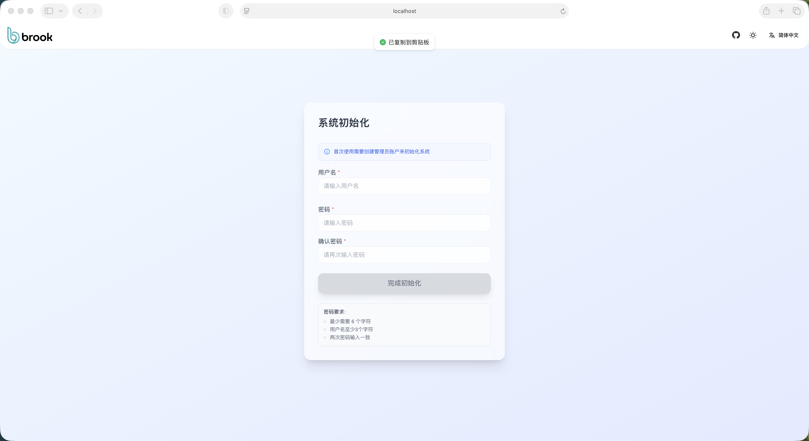
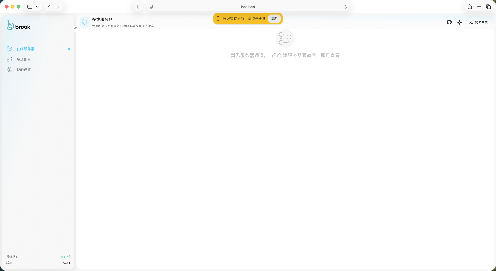
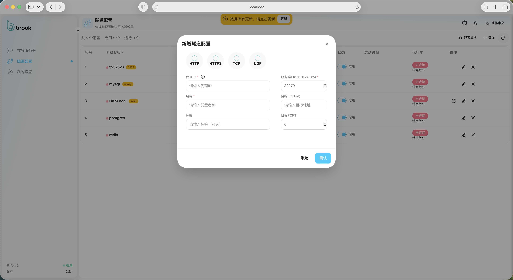
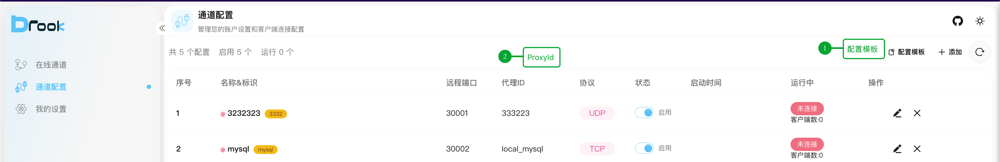
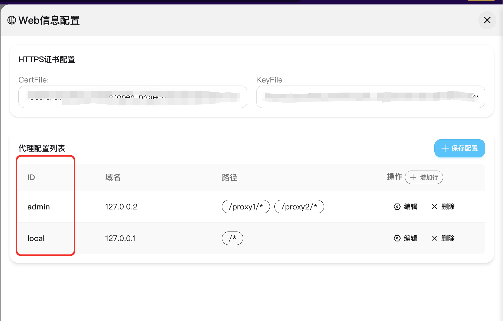

#  Brook

[English](document/README.en.md)

Brook 是一款跨平台（Linux / macOS / Windows）的高性能网络隧道与代理工具，使用 Go 语言编写。
支持 TCP、UDP、HTTP(S)、WebSocket 等隧道传输方式，兼容 SSH、HTTP、Redis、MySQL 等主流协议，并提供直观的可视化管理界面，便于配置与监控。

## 功能特性

- 支持 TCP / UDP / HTTP(S) / WebSocket 隧道
- 兼容多协议：SSH、HTTP(S)、MySQL、Redis 等
- 提供可视化界面，支持初始化、配置与状态监控
- 简单配置（`client.json`、`server.json`），支持自动重连与日志输出
- 轻量高效，跨平台运行
---

## 下载与安装

从 [GitHub Releases](https://github.com/g-brook/brook/releases) 下载适配你系统的二进制包：

| 平台 | 架构 | 文件名 | 类型 | 链接                                                                                             |
|------|------|--------|------|------------------------------------------------------------------------------------------------|
| Linux | x86_64 | `brook-sev_Linux-x86_64(amd64).tar.gz` | Server | https://github.com/g-brook/brook/releases/latest/download/brook-sev_Linux-arm64.tar.gz |
| Linux | arm64 | `brook-sev_Linux-arm64.tar.gz` | Server | https://github.com/g-brook/brook/releases/latest/download/brook-sev_Linux-arm64.tar.gz         |
| macOS | ARM64 (Apple M) | `brook-sev_macOS-ARM64(Apple-M).tar.gz` | Server | https://github.com/g-brook/brook/releases/latest/download/brook-sev_macOS-ARM64.Apple-M.tar.gz |
| macOS | Intel | `brook-sev_macOS-Intel.tar.gz` | Server | https://github.com/g-brook/brook/releases/latest/download/brook-sev_macOS-Intel.tar.gz         |
| Windows | x86_64 | `brook-sev_Windows-x86_64.tar.gz` | Server | https://github.com/g-brook/brook/releases/latest/download/brook-sev_Windows-x86_64.tar.gz      |

| 平台 | 架构 | 文件名 | 类型 | 链接                                                                                                  |
|------|------|--------|------|-----------------------------------------------------------------------------------------------------|
| Linux | x86_64 | `brook-cli_Linux-x86_64(amd64).tar.gz` | Client | https://github.com/g-brook/brook/releases/latest/download/brook-cli_Linux-arm64.tar.gz |
| Linux | arm64 | `brook-cli_Linux-arm64.tar.gz` | Client | https://github.com/g-brook/brook/releases/latest/download/brook-cli_Linux-arm64.tar.gz              |
| macOS | ARM64 (Apple M) | `brook-cli_macOS-ARM64(Apple-M).tar.gz` | Client | https://github.com/g-brook/brook/releases/latest/download/brook-sev_macOS-ARM64.Apple-M.tar.gz      |
| macOS | Intel | `brook-cli_macOS-Intel.tar.gz` | Client | https://github.com/g-brook/brook/releases/latest/download/brook-cli_macOS-Intel.tar.gz              |
| Windows | x86_64 | `brook-cli_Windows-x86_64.tar.gz` | Client | https://github.com/g-brook/brook/releases/latest/download/brook-cli_Windows-x86_64.tar.gz           |

提示：以上链接会自动指向最新版本（`/latest/download/`），也可前往 Releases 页面查看历史版本。

---

## 服务端快速开始

1) 解压下载的包并进入目录

```sh
mkdir -p ./brook-sev && tar -xzf brook-sev_Linux-arm64.tar.gz -C ./brook-sev
cd brook-sev
```

2) 更新 `server.json`

```json
{
  "enableWeb": true,
  "webPort": 8000,
  "serverPort": 8909,
  "tunnelPort": 8919,
  "token": "", // 非 Web 模式下可在此直接设置令牌
  "logger": { "logLevel": "info", "logPath": "./", "outs": "file" }
}
```

3) 启动服务

```sh
./brook-sev -c ./server.json
```

4) 打开管理界面

- 访问 `http://localhost:8000/index`
- 首次登录需初始化：
  - 设置管理员账号与密码
  - 登录后初始化 Token






---

## 客户端快速开始

1) 解压下载的包并进入目录

```sh
mkdir -p ./brook-cli && tar -xzf brook-cli_Linux-arm64.tar.gz -C ./brook-cli
cd brook-cli
```

2) 准备 `client.json`（可从服务端下载模板并更改）

```json
{
  "serverPort": 8909,
  "serverHost": "127.0.0.1",
  "token": "<在管理后台生成的Token>",
  "pingTime": 2000,
  "tunnels": [
    {
      "type": "udp",
      "destination": "127.0.0.1:9000",
      "proxyId": "333223"
    },
    {
      "type": "http",
      "destination": "127.0.0.1:8081",
      "proxyId": "HttpLocal-2",
      "httpId": "local"
    }
  ]
}
```

3) 启动客户端

```sh
./brook-cli -c ./client.json
```

4) 模板与标识获取

- 从服务端获取 `ProxyId` 模板：
  
- 获取 `httpId`（仅 HTTP/HTTPS 隧道需要）：
  

---

## 配置参考

服务端 `server.json` 关键项：

- `enableWeb`: 是否启用 Web 管理界面
- `webPort`: Web 管理端口（默认 8000，建议 4000–9000 范围）
- `serverPort`: 服务管理端口（默认 8909）
- `tunnelPort`: 数据隧道端口（默认 `serverPort + 10`）
- `token`: 非 Web 模式下用于认证的静态令牌
- `logger`: 日志配置（`logLevel`、`logPath`、`outs`）

客户端 `client.json` 关键项：

- `serverHost`: 服务端地址（IP 或域名）
- `serverPort`: 服务管理端口（与服务端一致）
- `token`: 在管理后台初始化生成，用于登录与通道绑定
- `pingTime`: 心跳间隔（毫秒），建议不低于 2000
- `tunnels`: 通道数组
  - `type`: 隧道类型（`tcp` / `udp` / `http` / `websocket`）
  - `destination`: 本地转发目标，如 `127.0.0.1:8081`
  - `proxyId`: 在服务端创建通道时生成的标识
  - `httpId`: 仅 HTTP/HTTPS 隧道使用，需与服务端 Web 设置一致

CLI 启动参数：

- 服务端：`./brook-sev -c ./server.json` 或 `./brook-sev --configs ./server.json`
- 服务端后台启动：`nohup ./brook-sev > app.log 2>&1 &`
- 客户端：`./brook-cli -c ./client.json` 或 `./brook-cli --configs ./client.json`
- 客务端后台启动：`nohup ./brook-cli > app.log 2>&1 &`

---

## 从源码构建
- 前端构建(要启动服务端，需要构建前端，生成页面)：
  - 进入 `portal/server/` 目录并执行：`npm install`、`npm run build`
- 服务端：
  - 进入 `server/` 目录并执行：`bash gobuild.sh`
  - 按提示选择平台与架构，生成包位于 `server/dist/brook-sev_*.tar.gz`

- 客户端：
  - 进入 `client/` 目录并执行：`bash gobuild.sh`
  - 生成包位于 `client/dist/brook-cli_*.tar.gz`

---

## 常见问题（FAQ）

- 解压命令错误：请使用 `tar -xzf <file>.tar.gz` 而非 `tar -czvf`（后者为打包）。
- 无法连接：核对 `serverHost`、`serverPort`、`token`；确保服务端已启动且防火墙放行端口。
- HTTP/HTTPS 隧道：客户端的 `httpId` 必须与服务端 Web 中的设置一致。
- 端口占用：如 8000/8909/8919 已被占用，可在配置中修改为可用端口。
- 日志定位：查看 `logger.logPath` 下的日志文件，必要时调整 `logLevel` 为 `debug`。

---

## 项目结构

- `server/`: 服务端主程序与 Web 管理界面
- `client/`: 客户端主程序与 CLI 交互界面
- `common/`: 通用组件（配置、日志、传输、协议等）
- `portal/server/`: 前端管理页面（Vite 项目）
- `document/`: 使用截图与资源

如需更多使用示例或协议支持详情，请查看源码目录中的实现与注释。
