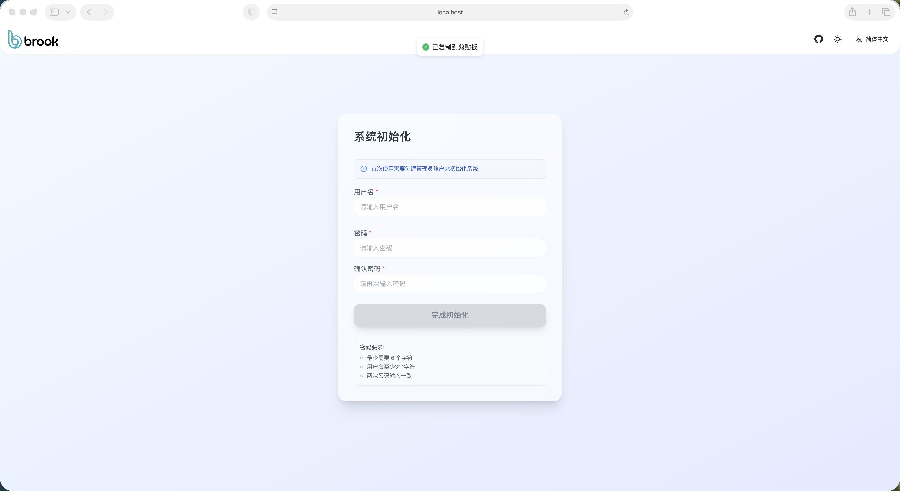
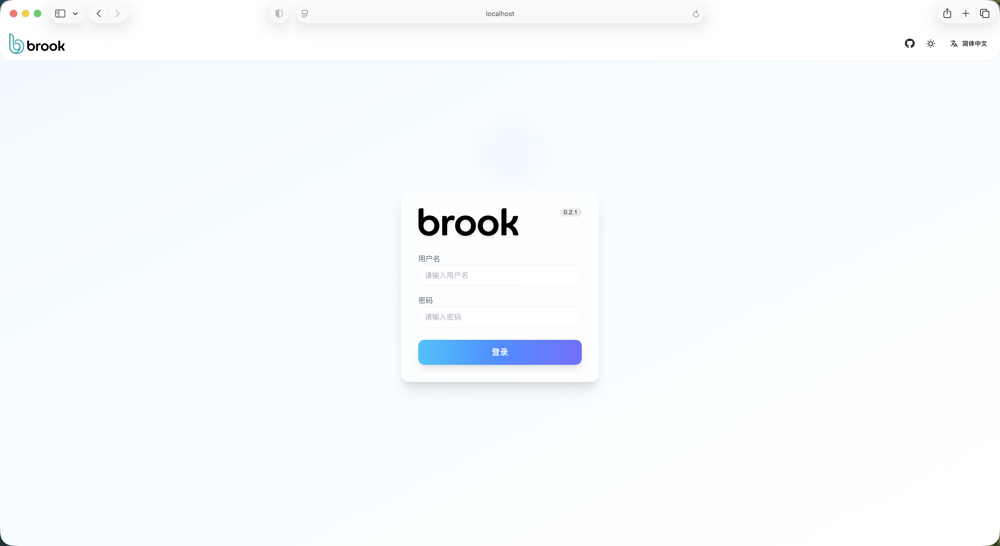
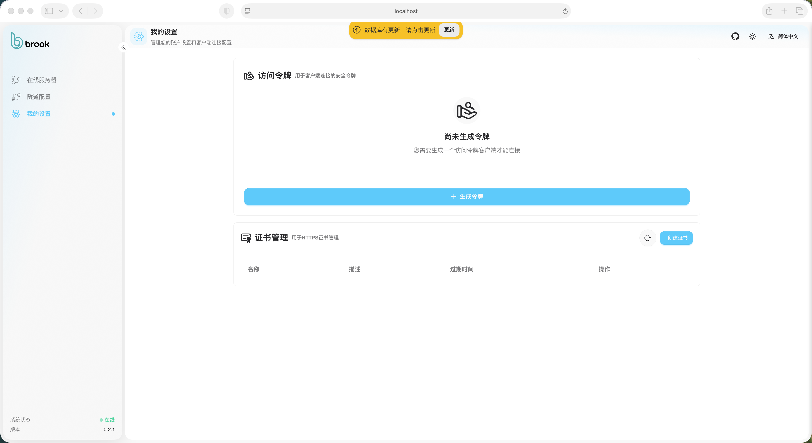
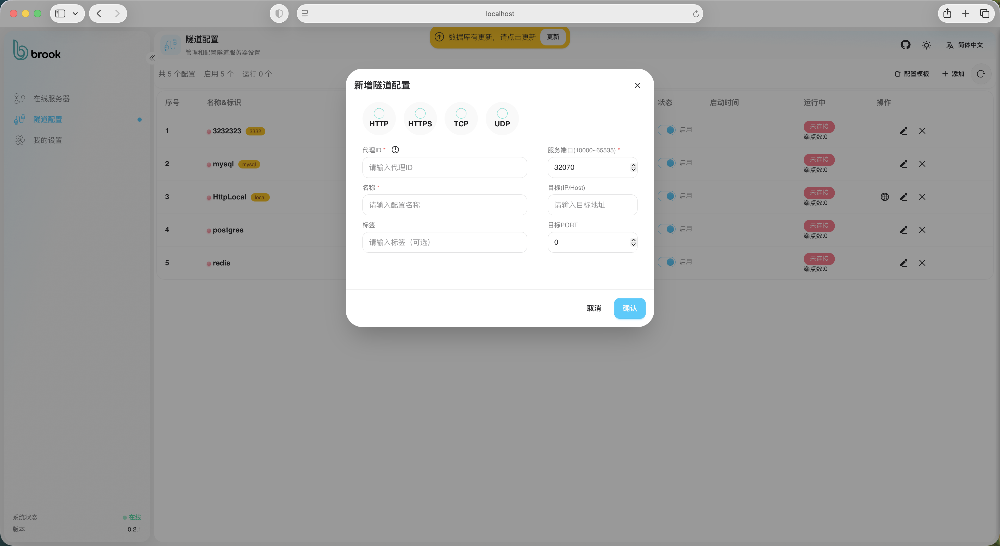

<p align="center">
  
</p>

<p align="center">
  
</p>

<p align="center">
  <strong>一款高性能、跨平台、极简配置的内网穿透与网络代理工具</strong>
</p>

<p align="center">
  <a href="https://github.com/g-brook/brook/releases">
    
  </a>
  <a href="https://github.com/g-brook/brook/stargazers">
    
  </a>
  <a href="https://github.com/g-brook/brook/network/members">
    
  </a>
  <a href="https://github.com/g-brook/brook/blob/main/LICENSE">
    
  </a>
  
  <a href="https://github.com/g-brook/brook/issues">
    
  </a>
</p>

<p align="center">
  <a href="README.md">English</a> |
  <a href="https://www.gbrook.cc">官方网站</a> |
  <a href="#-快速开始">快速开始</a> |
  <a href="#-常见问题解答faq">常见问题</a>
</p>

---

**Brook** 是一款专为内网穿透设计的高性能网络隧道工具，采用 Go 语言开发。它不仅支持多种传输协议（TCP, UDP, HTTP, WebSocket），更通过直观的 Web 管理界面，将复杂的隧道配置变得极其简单。无论是开发者调试、内网服务暴露，还是构建私有网络通道，Brook 都是您的理想选择。

## ✨ 核心亮点

- 🚀 **极速性能**：基于 Go 协程的高并发架构，低延迟、低资源占用。
- 🛡️ **全能兼容**：支持 SSH、HTTP/HTTPS、MySQL、Redis、RDP 等几乎所有主流应用协议。
- 🎨 **可视化管理**：内置现代化的 Web 面板，一键初始化，实时监控流量与连接状态。
- 🔗 **多变协议**：原生支持 TCP / UDP / HTTP(S) / WebSocket 隧道，轻松应对各种网络环境（包括 CDN 和防火墙限制）。
- 🛠️ **极简配置**：只需一个 JSON 文件，支持自动重连，让运维无忧。
- 💻 **跨平台支持**：预编译包覆盖 Linux, macOS (Intel/M-series), Windows (x64/ARM64)。

---

## 📸 界面预览

<details>
<summary>点击展开查看管理界面截图</summary>

| **初始化向导** | **安全登录** |
|:---:|:---:|
|  |  |
| **Token 管理** | **隧道配置** |
|  |  |

</details>

---

## ⚡ 快速开始

### 1. 一键在线安装 (推荐)
```shell
bash -c "$(curl -fsSL https://www.gbrook.cc/install.sh)"
```

### 2. 手动部署服务端
1. **下载并解压**：从 [GitHub Releases](https://github.com/g-brook/brook/releases) 下载对应平台的 `brook-sev`。
2. **准备配置** (`server.json`)：
   ```json
   {
     "enableWeb": true,
     "webPort": 8000,
     "serverPort": 8909,
     "tunnelPort": 8919,
     "logger": { "logLevel": "info", "logPath": "./", "outs": "file" }
   }
   ```
3. **启动服务**：
   ```shell
   ./brook-sev -c ./server.json
   ```
4. **访问面板**：打开浏览器访问 `http://your-ip:8000/index` 进行初始化。

### 3. 配置客户端
1. **获取 Token**：在 Web 管理后台生成。
2. **准备配置** (`client.json`)：
   ```json
   {
     "serverHost": "your-server-ip",
     "serverPort": 8909,
     "token": "YOUR_GENERATED_TOKEN",
     "tunnels": [
       { "type": "tcp", "destination": "127.0.0.1:80", "proxyId": "web-proxy-1" }
     ]
   }
   ```
3. **启动客户端**：
   ```shell
   ./brook-cli -c ./client.json
   ```

---

## 📥 资源下载

### 服务端 (brook-sev)

| 平台 | 架构 | 文件 | 直链下载 |
| :--- | :--- | :--- | :---: |
| Linux | amd64 | `brook-sev_Linux-x86_64.amd64.tar.gz` | [⬇️ 下载](https://github.com/g-brook/brook/releases/latest/download/brook-sev_Linux-x86_64.amd64.tar.gz) |
| Linux | arm64 | `brook-sev_Linux-arm64.tar.gz` | [⬇️ 下载](https://github.com/g-brook/brook/releases/latest/download/brook-sev_Linux-arm64.tar.gz) |
| macOS | ARM64 (Apple M) | `brook-sev_macOS-ARM64.Apple-M.tar.gz` | [⬇️ 下载](https://github.com/g-brook/brook/releases/latest/download/brook-sev_macOS-ARM64.Apple-M.tar.gz) |
| macOS | Intel | `brook-sev_macOS-Intel.tar.gz` | [⬇️ 下载](https://github.com/g-brook/brook/releases/latest/download/brook-sev_macOS-Intel.tar.gz) |
| Windows | x86_64 | `brook-sev_Windows-x86_64.tar.gz` | [⬇️ 下载](https://github.com/g-brook/brook/releases/latest/download/brook-sev_Windows-x86_64.tar.gz) |
| Windows | ARM64 | `brook-sev_Windows-ARM64.tar.gz` | [⬇️ 下载](https://github.com/g-brook/brook/releases/latest/download/brook-sev_Windows-ARM64.tar.gz) |

### 客户端 (brook-cli)

| 平台 | 架构 | 文件 | 直链下载 |
| :--- | :--- | :--- | :---: |
| Linux | amd64 | `brook-cli_Linux-x86_64.amd64.tar.gz` | [⬇️ 下载](https://github.com/g-brook/brook/releases/latest/download/brook-cli_Linux-x86_64.amd64.tar.gz) |
| Linux | arm64 | `brook-cli_Linux-arm64.tar.gz` | [⬇️ 下载](https://github.com/g-brook/brook/releases/latest/download/brook-cli_Linux-arm64.tar.gz) |
| macOS | ARM64 (Apple M) | `brook-cli_macOS-ARM64.Apple-M.tar.gz` | [⬇️ 下载](https://github.com/g-brook/brook/releases/latest/download/brook-cli_macOS-ARM64.Apple-M.tar.gz) |
| macOS | Intel | `brook-cli_macOS-Intel.tar.gz` | [⬇️ 下载](https://github.com/g-brook/brook/releases/latest/download/brook-cli_macOS-Intel.tar.gz) |
| Windows | x86_64 | `brook-cli_Windows-x86_64.tar.gz` | [⬇️ 下载](https://github.com/g-brook/brook/releases/latest/download/brook-cli_Windows-x86_64.tar.gz) |
| Windows | arm64 | `brook-cli_Windows-arm64.tar.gz` | [⬇️ 下载](https://github.com/g-brook/brook/releases/latest/download/brook-cli_Windows-arm64.tar.gz) |

---

## 🛠️ 进阶开发

### 从源码构建
```bash
# 前端构建
cd portal/server/ && npm install && npm run build

# 服务端/客户端构建
cd server/ && bash build.sh
cd client/ && bash build.sh
```

---

## ❓ 常见问题解答 (FAQ)

<details>
<summary>如何解决连接超时？</summary>
请确保服务端的 8909 和 8919 端口已在防火墙/安全组中开放。
</details>

<details>
<summary>支持 CDN 转发吗？</summary>
是的，通过使用 WebSocket 协议隧道，您可以配合 Nginx 或 Cloudflare 实现 CDN 转发。
</details>

<details>
<summary>如何实现后台运行？</summary>
Linux 用户可以使用 `systemd` 脚本或直接运行 `sudo ./brook-cli start`。
</details>

---

## 📄 开源协议
本项目采用 [Apache License 2.0](LICENSE) 协议开源。

---

<p align="center">
  <b>如果 Brook 对您有所帮助，请点一个 ⭐ Star 以资鼓励！</b><br/>
  
</p>
